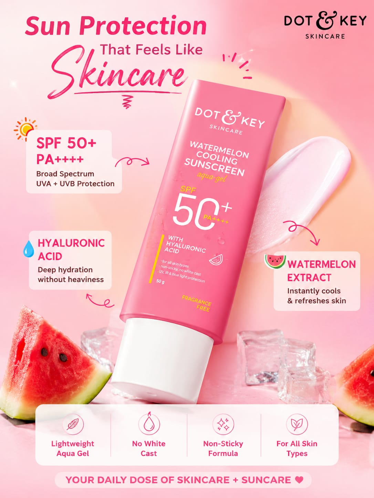

# FUTURE_PE_02

# AI Content Marketing Using UGC Ads

## Overview

This project was completed as part of the Future Interns Prompt Engineering Program.

The objective of this project is to create AI-powered UGC (User Generated Content) advertising content for a real-world product using structured prompt engineering techniques.

The selected product for this project is **Dot & Key Watermelon Cooling Sunscreen SPF 50+**. Using AI-generated prompts, multiple ad hooks, UGC scripts, and conversion-focused CTAs were created to simulate a real content marketing workflow.

---

## Product Selected

### Dot & Key Watermelon Cooling Sunscreen SPF 50+

A lightweight sunscreen that provides SPF 50+ protection while keeping the skin cool, hydrated, and protected from harmful UV rays.

---

## Instagram Ad Output



### Ad Headline

**Stay Protected Without The Sticky Feel**

### Key Benefits

- SPF 50+ Protection
- Lightweight & Non-Greasy
- No White Cast
- Cooling Watermelon Extract
- Suitable for Daily Use

### Call To Action

**Protect your skin every day with Dot & Key Watermelon Cooling Sunscreen SPF 50+.**

---

## Project Objectives

- Generate scroll-stopping UGC hooks
- Create authentic UGC-style ad scripts
- Produce high-converting CTA lines
- Demonstrate AI-powered content marketing workflows
- Build reusable prompt systems for advertising campaigns

---

## Prompt Files

### hooks_prompt.md
Generates multiple engaging hooks for social media advertisements.

### ugc_script_prompt.md
Creates authentic UGC-style advertisement scripts using:

- Hook
- Problem
- Solution
- Experience
- CTA

### cta_prompt.md
Generates conversion-focused call-to-action lines.

---

## Generated Outputs

### UGC Hooks
A collection of attention-grabbing hooks designed for Instagram Reels and Shorts.

### UGC Advertisement Script
A complete short-form UGC ad script highlighting the product benefits in a natural and relatable way.

### CTA Collection
Multiple persuasive CTA lines focused on improving engagement and conversions.

---

## Repository Structure

```text
FUTURE_PE_02

README.md

prompts/
├── hooks_prompt.md
├── ugc_script_prompt.md
└── cta_prompt.md

outputs/
├── hooks_output.md
├── ugc_scripts.md
└── cta_output.md

screenshots/
├── prompt_input.png
├── hooks_output.png
├── ugc_script_output.png
├── github_structure.png
└── dot_and_key_poster.png
```

---

## Tools Used

- ChatGPT
- GitHub
- Prompt Engineering Techniques

---

## Skills Demonstrated

- Prompt Engineering
- AI Content Marketing
- UGC Ad Creation
- Conversion Copywriting
- Content Strategy
- Social Media Marketing

---

## Screenshots

Project screenshots and generated outputs are available in the **screenshots** folder.

---

## Author

**Ruchitha Sri**

Future Interns – Prompt Engineering Internship Program

---

## Task

Prompt Engineering Task 2 – AI Content Marketing Using UGC Ads

This project demonstrates how AI can be used to generate marketing-ready UGC content for real products through effective prompt engineering.
